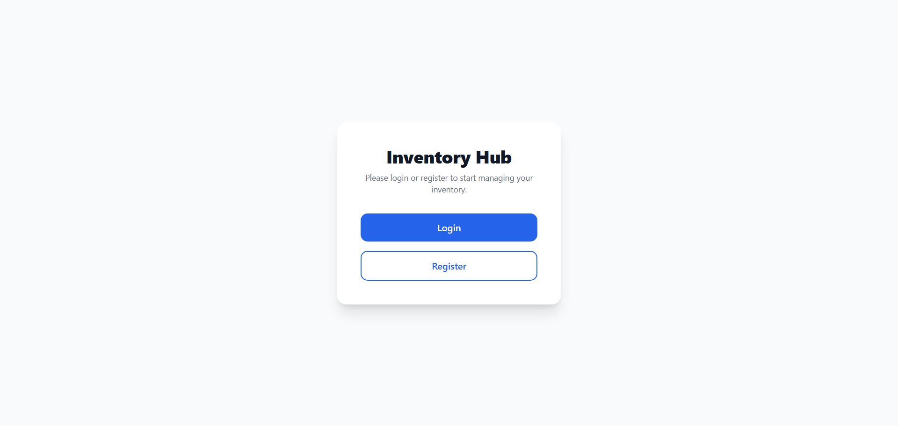
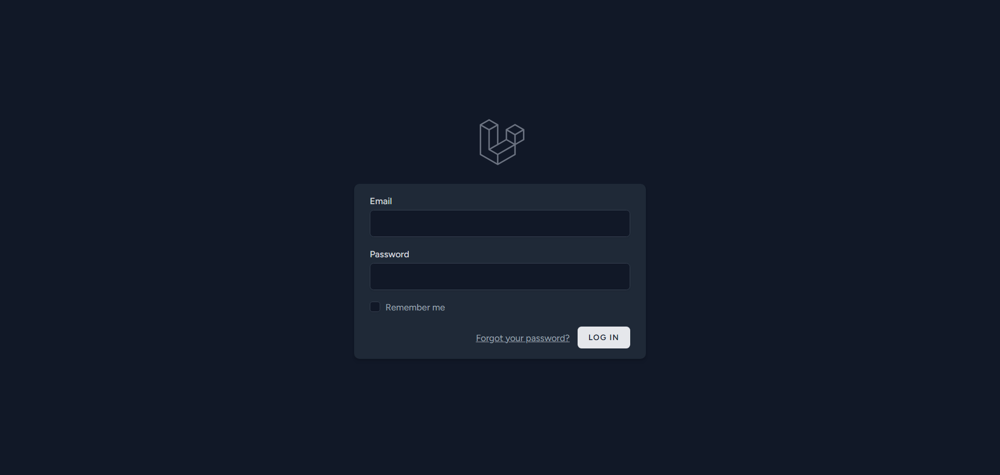
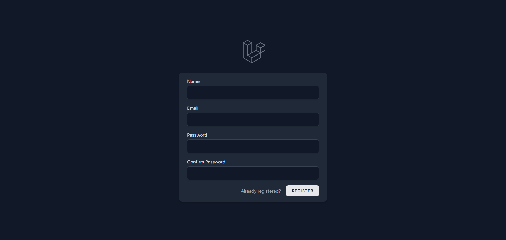
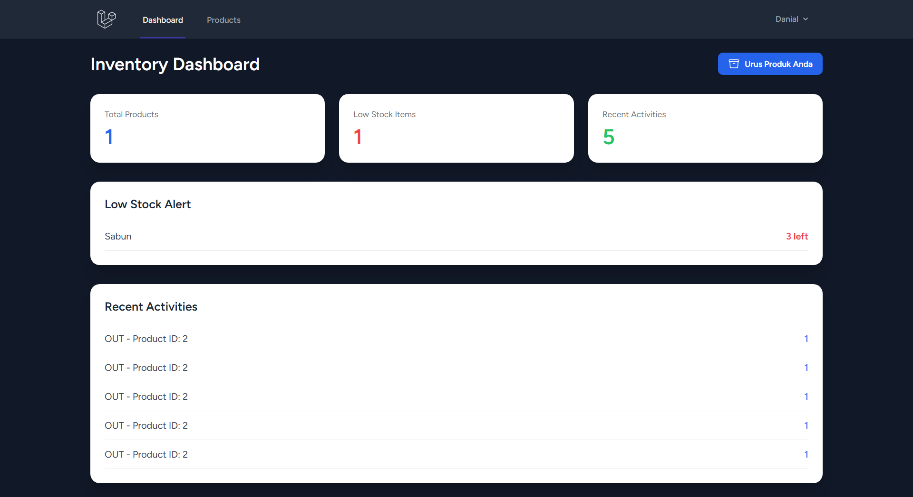
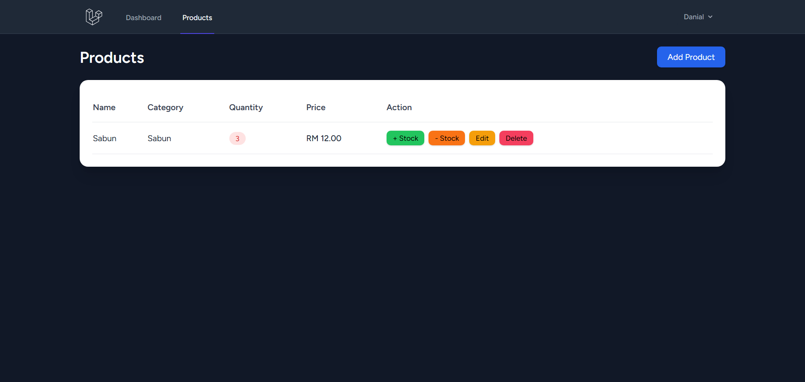

# Inventory Hub 📦

A simple, modern, and efficient inventory management system built with Laravel.


## Overview

Inventory Hub is a streamlined inventory management solution designed for individuals and small businesses to effortlessly keep track of their products. It allows users to manage their product catalog, track stock levels in real-time, and monitor recent inventory activities (stock in/out) through a clean, intuitive dashboard.

## Features

**User Management**
- Secure login, registration, and profile management.

**Dashboard**
- View total products managed by the user.
- Real-time alerts for low-stock items.
- Monitor recent stock activities (Stock In / Stock Out).

**Inventory Control**
- Complete CRUD (Create, Read, Update, Delete) operations for inventory items.
- Dedicated "Stock In" and "Stock Out" actions for quick stock tracking.

## Tech Stack

| Category | Technology |
| :--- | :--- |
| **Framework** | Laravel (PHP) |
| **Database** | MySQL / SQLite |
| **Styling** | Tailwind CSS |
| **Frontend** | Alpine.js |

## Screenshots

<!-- Replace the filenames below with the actual names of your files -->






## Getting Started

### Prerequisites

- PHP 8.1 or higher
- Composer
- Node.js & NPM
- MySQL or SQLite

### Installation

1. **Clone the repository** (if applicable) or extract the project files into your local server directory.
   ```bash
   git clone <repository-url>
   cd inventoryhub
   ```

2. **Install PHP dependencies:**
   ```bash
   composer install
   ```

3. **Install and compile frontend dependencies:**
   ```bash
   npm install
   npm run build
   ```

4. **Environment Setup:**
   Copy the `.env.example` file to `.env` and configure your database settings.
   ```bash
   cp .env.example .env
   php artisan key:generate
   ```

5. **Run Database Migrations:**
   ```bash
   php artisan migrate
   ```

6. **Serve the Application:**
   ```bash
   php artisan serve
   ```
   Visit `http://localhost:8000` in your browser to access the application.

## Usage

1. Open your browser and navigate to `http://localhost:8000`.
2. Register a new user account or log in with your existing credentials.
3. Use the **Products** section to add new items to your inventory.
4. Manage stock levels using the **Stock In** and **Stock Out** functionalities.
5. Monitor your overall inventory health from the **Dashboard**.

## Project Structure

```text
inventoryhub/
├── app/                  # Application core logic (Models, Controllers)
├── bootstrap/            # Framework bootstrap files
├── config/               # Configuration files
├── database/             # Migrations, factories, and seeders
├── public/               # Publicly accessible files (assets, index.php)
├── resources/            # Views (Blade templates), raw assets (CSS/JS)
├── routes/               # Application routes (web.php, api.php)
├── storage/              # Compiled templates, logs, file uploads
├── tests/                # Automated tests
└── vendor/               # Composer dependencies
```

## Future Improvements

- Add user roles and permissions (Admin vs. Standard User).
- Implement PDF/CSV export for inventory reports.
- Add barcode/QR code scanning support.
- Implement automated low-stock email notifications.

## License

This project is open-sourced software licensed under the MIT license.